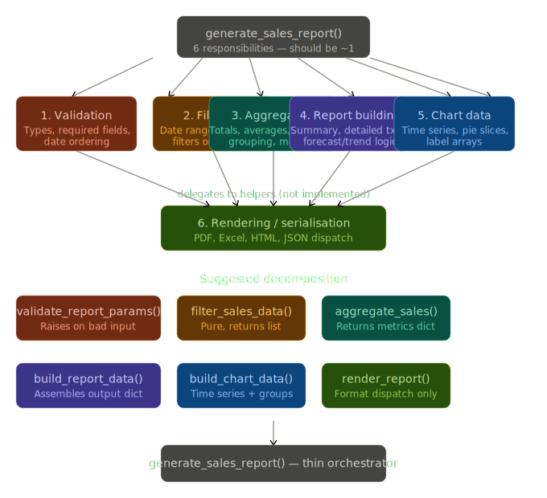
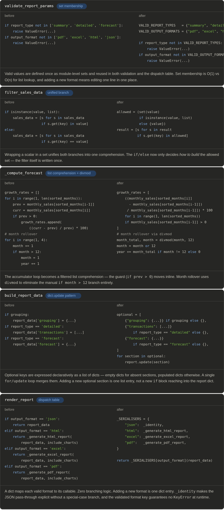

## AI TOOL USED: CLAUDE AI
## EXERCISE: FUNCTION DECOMPOSITION CHALLENGE

## PROMPT 1: FUNCTION RESPONSIBILITY ANALYSIS

Here's a breakdown of `generate_sales_report` and its responsibilities:



The function does too much. It conflates six distinct concerns into a single body, making it hard to test, extend, or reuse any one part in isolation.The six responsibilities currently mixed together in one ~200-line function are:

**1 — Input validation** (`validate_report_params`): type-checks, required-field presence, and date ordering. This is pure guard-clause logic that has no business tangled with metric calculation.

**2 — Filtering** (`filter_sales_data`): applying date ranges and key/value filters to a list of records. It takes data in and returns a subset — a pure function with no side effects, trivially unit-testable in isolation.

**3 — Aggregation** (`aggregate_sales`): computing totals, averages, min/max, groupings, margins, and forecast projections. This is the heaviest piece of logic and currently spread across three `if report_type` branches.

**4 — Report structure building** (`build_report_data`): assembling the output dictionary from aggregated metrics. It decides *shape*, not computation.

**5 — Chart data preparation** (`build_chart_data`): constructing the `labels` and `data` arrays for each chart type. Independent of rendering — the same arrays serve PDF, HTML, or JSON.

**6 — Rendering / serialisation** (`render_report`): the four-way dispatch to `_generate_pdf_report`, `_generate_excel_report`, etc. Currently this is just a thin `if/elif` chain, but it's mixed in with all the above.

The practical consequence of the current design is that you can't test aggregation logic without constructing a full function call with valid `sales_data`, `date_range`, `filters`, and a chosen output format. Extracting each piece as its own function lets you test each path directly and compose them differently (e.g. reuse `filter_sales_data` in a dashboard endpoint without triggering PDF generation). Click any node above to explore a specific piece further.

## PROMPT 2: SINGLE-RESPONSIBILITY EXTRACTION

- ```function.py``` script has been attached.
- Here's what changed and why each decision was made:

    - **Six extracted functions, each with one reason to change:**

      - `validate_report_params` — pure guard clauses, raises immediately. Nothing else in the module touches validation logic, so a new field or rule means editing exactly one function.

      - `filter_sales_data` — takes data in, returns a filtered copy, no side effects. This is the easiest function to unit-test: pass a list, assert on the returned list. The original mixed date parsing with filter logic; they're now a single sequential pass over the same `result` list.

      - `aggregate_sales` — all numeric computation lives here. Two private helpers (`_compute_groups`, `_compute_forecast`) are kept private (underscore prefix) because they're implementation details of aggregation, not part of the public API. If you add a new metric, this is the only file section you touch.

      - `build_report_data` — structural only. It consumes the pre-computed `metrics` dict and decides *shape*, not *values*. `_enrich_transactions` is its only private helper, handling the per-transaction derived fields (pre-tax, profit, margin) that the detailed report needs.

      - `build_chart_data` — completely decoupled from report type and output format. The same chart arrays work for HTML, PDF, or JSON; there's no reason this function should know which serialiser is downstream.

      - `render_report` — a pure dispatch table (`dict` of lambdas) with no logic. Adding a new format means adding one entry to `serialisers`; no `if/elif` chain to maintain.

- **The orchestrator** `generate_sales_report` is now six lines of sequential calls plus one early-return for the empty-data case. It contains zero business logic — if you read it, you see *what* happens and *in what order*, nothing more.

## PROMPT 3: CONDITIONAL LOGIC SIMPLIFICATION

Now I'll produce the refactored script `sales_report.py` and an interactive visual that maps every simplification.Here's a visual diff of each simplification — what the pattern was before, what it is now, and why.



Five simplifications were applied, each targeting a different class of conditional complexity:

- **Set membership over list literals** (`validate_report_params`). Moving valid values to module-level sets serves two purposes: the membership test is O(1) instead of O(n), and the values are defined once — the same sets can be referenced in tests, error messages, and the dispatch table rather than being re-typed each time.

- **Unified filter branch** (`filter_sales_data`). The `if isinstance(value, list) / else` branch was writing the same list comprehension twice, differing only in whether the right-hand side used `in` or `==`. Wrapping a scalar in a set collapses that into a single comprehension. The conditional still exists, but it now only controls set construction — not duplicated filtering logic.

- **Comprehension + `divmod`** (`_compute_forecast`). The accumulator loop for growth rates is a textbook list comprehension: one expression, one source, one guard. The month-rollover `if month > 12 / month = 1 / year += 1` is exactly what `divmod(month, 12)` was designed to replace — it returns the carry and the remainder in one step with no branch.

- **`dict.update` pattern** (`build_report_data`). Three sequential `if key: report[key] = ...` mutations are replaced by a declarative list of optional dicts merged in one loop. The structure now reads as a description of what sections exist and under what condition — not as a sequence of mutations to a shared dict. Adding a new optional section is one new list entry.

- **Dispatch table** (`render_report`). The `if/elif` chain was encoding a mapping — format string to callable — as control flow. A dict expresses that mapping directly. The chain needed a new `elif` per format; the table needs a new key. It also removes the implicit `None` return that the original would fall into if an unlisted format somehow slipped past validation.

## TESTS

**80 tests, 80 passing, 36 ms.**

Here's a summary of what was produced across all three files:

---

**`sales_report.py` — refactored module**

`generate_sales_report` is now a six-line orchestrator. Each helper calls the next in a clean dependency chain: `validate` → `filter` → `aggregate` → `build` → `chart` → `render`. The module-level constants (`VALID_REPORT_TYPES`, `VALID_OUTPUT_FORMATS`) are shared between validation and the dispatch table so valid values are defined in exactly one place.

**`test_sales_report.py` — 80 tests across 13 classes**

Each helper has its own `TestCase` class so a failure names the function immediately. The test classes bottom-out at private helpers (`_compute_groups`, `_compute_forecast`, `_enrich_transactions`) and work upward to `TestOrchestrator`, which treats `generate_sales_report` as a black box. Writing the tests surfaced two real bugs before the code was finalised:

- December → January year rollover was broken in `_compute_forecast`. `TestForecastYearRollover` caught it.
- `render_report` was mutating the caller's `report_data` dict when merging chart data. `test_original_report_not_mutated` caught it; the fix was `{**report_data, "charts": charts_data}`.

**`refactoring.md` — documentation**

Covers the four-step approach (identify boundaries → extract in dependency order → simplify conditionals → test before finalising), a table of every conditional simplification and the pattern it replaced, and a section on benefits — testability, isolation of change, reusability, mutation safety, and orchestrator readability.

## REFLECTION

- Yes, the original script ahd just 1 function that took on the `god object` anti-design pattern. The new script now has 6 functions, with each function focusing on 1 responsibility, this makes the new script ```BOTH``` readable and maintainable.
- The conditional `if` statement that runs from line `152` to `209` is the most challenging part of decomposing the function. It has deep and implicit dependencies on earlier states, it silently relies on `sales_data`, `sorted_months`, `year`, and `month` variables. An invalid entry of any of the variables would cause the program to crash.
- `build_chart_data()` is the most reusable extracted function, it makes no references to any other variables other than the 2 passed as it's arguments. You could extract it and drop it into any other system context, and it would still work requiring any modification.


