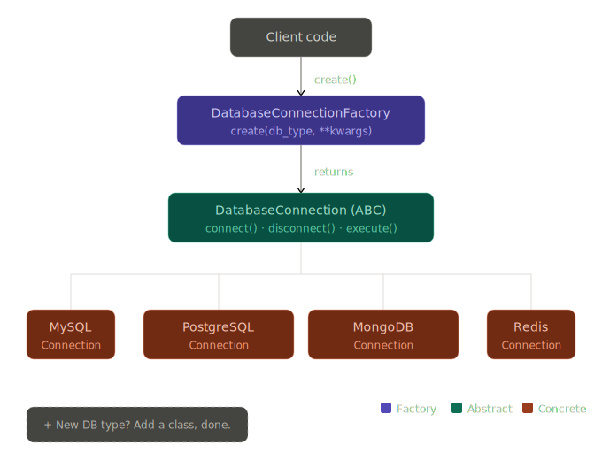
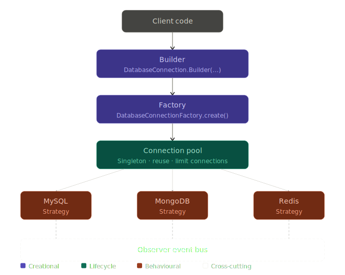

## AI TOOL USED: CLAUDE AI
## EXERCISE: DESIGN PATTERN IMPLEMENTATION CHALLENGE

## PROMPT 1: PATTERN OPPORTUNITY IDENTIFICATION

Looking at this code, I can see a few clear design pattern opportunities. Let me walk through them:

## 1. Factory Pattern — for object creation

The `DatabaseConnection` class is doing two things: storing config *and* knowing how to build connection strings for every DB type. A **Factory** would separate creation logic from the class itself.

```python
class DatabaseConnectionFactory:
    @staticmethod
    def create(db_type, **kwargs) -> "DatabaseConnection":
        connectors = {
            "mysql":      MySQLConnection,
            "postgresql": PostgreSQLConnection,
            "mongodb":    MongoDBConnection,
            "redis":      RedisConnection,
        }
        if db_type not in connectors:
            raise ValueError(f"Unsupported database type: {db_type}")
        return connectors[db_type](**kwargs)

# Usage
db = DatabaseConnectionFactory.create("mysql", host="localhost", port=3306, ...)
```

**Why:** Adding a new DB type means adding a new class — not touching existing ones (Open/Closed Principle). No more sprawling `elif` chains.

---

## 2. Strategy Pattern — for connection-string building

Each DB type has its own way of building a connection string. That logic is currently buried in one giant `connect()` method. A **Strategy** extracts each algorithm into its own class.

```python
class ConnectionStrategy(ABC):
    @abstractmethod
    def build_connection_string(self, config: dict) -> str: ...

class MySQLStrategy(ConnectionStrategy):
    def build_connection_string(self, config):
        url = f"mysql://{config['username']}:{config['password']}@{config['host']}:{config['port']}/{config['database']}"
        url += f"?charset={config.get('charset', 'utf8')}"
        if config.get("use_ssl"):
            url += "&useSSL=true"
        return url
```

The `connect()` method becomes trivially simple — it just calls `self.strategy.build_connection_string(config)` and connects. Swapping connection behavior at runtime becomes easy too.

---

## 3. Builder Pattern — for the complex constructor

An `__init__` with **11 parameters** is a red flag. A **Builder** makes construction readable and safe, especially when most params are optional.

```python
db = (DatabaseConnection.Builder("mysql")
        .host("localhost").port(3306)
        .credentials("db_user", "password123")
        .database("app_db")
        .with_ssl()
        .build())
```

No more remembering argument order, no more silent bugs from misplaced positional args. Each `.method()` call is self-documenting.

---

## 4. Singleton / Connection Pool — for resource management

Right now, nothing stops you from creating two `DatabaseConnection` objects pointing at the same DB. A **Singleton** (or pool manager) ensures one shared connection per database.

```python
class ConnectionPool:
    _instances: dict = {}

    @classmethod
    def get_connection(cls, db_type, host, database):
        key = f"{db_type}:{host}/{database}"
        if key not in cls._instances:
            cls._instances[key] = DatabaseConnectionFactory.create(...)
        return cls._instances[key]
```

This prevents resource exhaustion and is especially important for `pool_size` — that parameter only makes sense if someone is managing the pool.

---

## How the patterns fit together

```
ConnectionPool.get_connection("mysql", ...)
        │
        ▼
DatabaseConnectionFactory.create(...)   ← Factory Pattern
        │
        ▼
MySQLConnection(Builder config)         ← Builder Pattern
        │
        ▼
MySQLStrategy.build_connection_string() ← Strategy Pattern
```

The patterns are complementary, not competing. **Builder** cleans up construction, **Strategy** isolates the varying logic, **Factory** centralises which class gets built, and **Singleton/Pool** governs lifecycle.

The biggest immediate win would be the **Strategy + Factory** combo, as it eliminates the `elif` chain and makes the code genuinely extensible.

## PROMPT 2: PATTERN IMPLEMENTATION GUIDANCE

- Here's the uml diagram using the Factory pattern:



- The refactored script **refactored_fd.py** has been attached.
- Changes made:
  - `db_type` removed from `__init__` — each subclass is a type, so storing `self.db_type = 'mysql'` on a `MySQLConnection` would be redundant. The class itself carries that identity.
  - `_build_connection_string` is abstract — this forces every concrete class to implement it. Forgetting to add it for a new DB type becomes an immediate `TypeError` at instantiation rather than a silent runtime bug.
  - `_registry` dict in the factory — the `elif` chain is replaced with a plain dictionary lookup.
  - Adding Cassandra support is now just one line:
    - `DatabaseConnectionFactory.register('cassandra', CassandraConnection)`. Existing classes are never touched, which satisfies the Open/Closed Principle directly.
  - `register()` class method — this lets third-party code or plugins extend the factory without subclassing it or modifying the source file. It's the escape hatch that makes the pattern genuinely open for extension.

## PROMPT 3: MULTI-PATTERN ARCHITECTURE TRANSFORMATION

---

## 1. Improved architecture

- The three patterns you chose each own a distinct responsibility, and together they form a clean separation of concerns:The architecture has four layers, each with a clear job. The diagram below shows how they stack:Each pattern has a single, non-overlapping job. Builder handles construction. Factory handles type resolution. Pool handles lifecycle. Strategy handles algorithm variation. Observer handles cross-cutting events without coupling anything together.



---

## 2. How the patterns work together

- The key insight is that these patterns form a *pipeline*, not a jumble. Here's the complete flow when a client requests a connection:

```
Client calls Builder → Builder produces a validated config object
      ↓
Factory receives config → resolves the right concrete class + Strategy
      ↓
Pool checks if a live connection exists for this config key
      ↓
If not: Strategy.build_connection_string() → driver.connect()
      ↓
Observer broadcasts "connected" event to any registered listeners
      ↓
Client receives a DatabaseConnection, typed to the abstract interface
```

- The coupling is intentionally one-directional. The Builder doesn't know about the Factory. The Factory doesn't know about the Pool. The Observer knows about nothing — it just emits. This means you can swap out any layer independently.

- The Strategy and Observer patterns also play complementary roles inside `connect()`. Strategy answers *how* to connect (what string to build, what driver to call). Observer answers *that* a connection happened (logging, metrics, alerting). These were both tangled inside the original `connect()` method — separating them makes each independently testable.

---

## 3. Gradual refactoring plan

Doing everything at once is the fastest path to a broken codebase. Here's a safe, phase-by-phase approach where each step leaves the system working:

**Phase 1 — Observer (lowest risk, highest immediate value)**

Add the event system first because it's purely additive — nothing existing needs to change. You're just inserting hooks.

```python
from enum import Enum
from typing import Callable

class ConnectionEvent(Enum):
    CONNECTING   = "connecting"
    CONNECTED    = "connected"
    DISCONNECTED = "disconnected"
    ERROR        = "error"
    RETRY        = "retry"

class ConnectionEventBus:
    def __init__(self):
        self._listeners: dict[ConnectionEvent, list[Callable]] = {}

    def subscribe(self, event: ConnectionEvent, callback: Callable):
        self._listeners.setdefault(event, []).append(callback)

    def publish(self, event: ConnectionEvent, **data):
        for cb in self._listeners.get(event, []):
            cb(event=event, **data)

# Global bus — shared across the system
event_bus = ConnectionEventBus()
```

Then add two lines to the existing `connect()` method:

```python
def connect(self):
    event_bus.publish(ConnectionEvent.CONNECTING, db_type=self.db_type, host=self.host)
    # ... existing connect logic ...
    event_bus.publish(ConnectionEvent.CONNECTED, db_type=self.db_type)
```

Done. You now have observable connections with zero structural change.

**Phase 2 — Strategy (moderate refactor, isolated impact)**

Extract the `elif` chain from inside `connect()` into Strategy classes. The existing `DatabaseConnection` subclasses keep their `connect()` — you're only moving the string-building logic out.

```python
class ConnectionStrategy(ABC):
    @abstractmethod
    def build_connection_string(self, config: dict) -> str: ...

    @abstractmethod
    def create_driver_connection(self, conn_string: str): ...

class MySQLStrategy(ConnectionStrategy):
    def build_connection_string(self, config):
        url = (f"mysql://{config['username']}:{config['password']}"
               f"@{config['host']}:{config['port']}/{config['database']}"
               f"?charset={config.get('charset','utf8')}")
        if config.get('use_ssl'):
            url += "&useSSL=true"
        return url

    def create_driver_connection(self, conn_string):
        pass  # mysql.connector.connect(...)
```

Then `connect()` delegates:

```python
def connect(self):
    event_bus.publish(ConnectionEvent.CONNECTING, host=self.host)
    conn_string = self.strategy.build_connection_string(vars(self))
    self.connection = self.strategy.create_driver_connection(conn_string)
    event_bus.publish(ConnectionEvent.CONNECTED, host=self.host)
    return self.connection
```

**Phase 3 — Connection Pool (structural, test carefully)**

Wrap the Factory with a pool that reuses connections by key. The client API doesn't change — they still call `create()`.

```python
class ConnectionPool:
    _instance: "ConnectionPool | None" = None
    _lock = threading.Lock()

    def __new__(cls):
        if cls._instance is None:
            with cls._lock:
                if cls._instance is None:
                    cls._instance = super().__new__(cls)
                    cls._instance._pool: dict[str, DatabaseConnection] = {}
        return cls._instance

    def get_connection(self, db_type: str, **kwargs) -> DatabaseConnection:
        key = f"{db_type}:{kwargs['host']}:{kwargs['port']}/{kwargs['database']}"
        with self._lock:
            if key not in self._pool or not self._is_alive(key):
                conn = DatabaseConnectionFactory.create(db_type, **kwargs)
                conn.connect()
                self._pool[key] = conn
                event_bus.publish(ConnectionEvent.CONNECTED, key=key)
            return self._pool[key]

    def _is_alive(self, key: str) -> bool:
        return self._pool[key].connection is not None
```

**Phase 4 — Builder (polish, purely ergonomic)**

Add the Builder last since it's the least risky — it only affects the construction call site, not any internals.

```python
class DatabaseConnection:
    class Builder:
        def __init__(self, db_type: str):
            self._config = {'db_type': db_type}

        def host(self, host: str, port: int):
            self._config.update({'host': host, 'port': port})
            return self

        def credentials(self, username: str, password: str):
            self._config.update({'username': username, 'password': password})
            return self

        def database(self, name: str):
            self._config['database'] = name
            return self

        def with_ssl(self):
            self._config['use_ssl'] = True
            return self

        def build(self) -> "DatabaseConnection":
            self._validate()
            return ConnectionPool().get_connection(**self._config)

        def _validate(self):
            required = {'db_type', 'host', 'port', 'username', 'password', 'database'}
            missing = required - self._config.keys()
            if missing:
                raise ValueError(f"Missing required fields: {missing}")
```

---

## 4. Risks and mitigations

- **Thread safety in the pool.** The Singleton pool will be hit from multiple threads in any real application. The `threading.Lock()` shown above guards the pool dict, but be careful: acquiring the lock during `connect()` itself could cause contention if connections are slow. Mitigate by checking existence under the lock, then connecting *outside* it using a double-checked pattern.

- **Stale connections.** A pool connection can silently go dead (DB restart, network timeout). The `_is_alive()` check needs to be more than `connection is not None` — implement a lightweight ping using the driver's own health-check API. Without this, the pool returns dead connections and errors surface unpredictably.

- **`kwargs` opacity.** Passing `**kwargs` through the Factory means type errors surface at instantiation, not at the call site. If you call `create('mysql', poort=3306)` (typo), you get a confusing `TypeError` deep inside `MySQLConnection.__init__`. The Builder's `_validate()` catches this early. This is a strong argument for making the Builder the *only* entry point to the Factory in production code.

- **Observer callback failures.** If a subscribed callback raises an exception, it can crash the connect flow. Wrap `publish()` calls so listener errors are logged but never propagated:

```python
def publish(self, event, **data):
    for cb in self._listeners.get(event, []):
        try:
            cb(event=event, **data)
        except Exception as e:
            logging.error(f"Observer callback failed: {e}")
```

- **Pool exhaustion.** The current pool stores one connection per key. In high-load scenarios you need `pool_size` *actual* connections per DB, with a queue for waiters. Consider `queue.Queue` per key and a max-wait timeout. This is where the `pool_size` parameter from the original code finally gets properly used.

---

## 5. How the new architecture improves things

- The original code had three maintainability problems baked into its structure: a single class that knew everything, logic scattered across a long `connect()` method, and no visibility into what the connection was doing at runtime.

- The multi-pattern architecture addresses each directly.

- Adding a new database type in the original code meant editing `connect()`, inserting another `elif`, and hoping nothing else broke. In the new architecture it means writing one new Strategy class and registering it — the existing code is never touched. The Open/Closed Principle is now a structural guarantee, not an aspiration.

- Testing was previously impossible without a real database. Now each layer is independently testable: the Builder can be unit tested with just a config dict, Strategies can be tested by asserting the connection string they produce, and the Pool can be tested with mock connections. The Observer lets you assert that events fired without ever touching the connection itself.

- Observability went from zero to complete. Every connect, disconnect, retry, and error is now a published event. Plugging in a logging listener, a metrics collector, or an alerting system is a one-line `subscribe()` call with no changes anywhere else in the codebase.

- The Builder eliminates an entire class of bugs — misconfigured connections that fail at runtime because `use_ssl` ended up in the wrong position, or `pool_size` was silently ignored. Validation happens at build time, close to where the mistake was made.

- Finally, the Singleton pool means the original code's silent resource leak — creating a new connection object for every request — is structurally impossible. One connection per DB target, reused and health-checked, with the lifecycle managed in one place.

## REFLECTION

- Initially, the original code had what is known as a `god object` anti-pattern, when one class takes on too much responsibility. The class `DatabaseConnection` knew how to store config, build connection strings for every database type, manage its own connection, and handle errors. The client knew too much without the factory pattern, but with it, the client only knows the interface. This makes the new code **BOTH** reusable and maintainable.
- Adding a new database type is now easy and fast. Write a `CassandraStrategy` and then register it with the Factory, done. No existing file needs editing. Before, every new DB type was an edit to `connect()` — a file that also contained MySQL, PostgreSQL, MongoDB, and Redis logic, any of which could be accidentally broken.
- In design patterns, you normally create each class in it's own script, but that created circular imports in this case. The `**kwargs` argument in ```create()``` bloated the `__init__()`, the constructor had to deal with many DB types that all required a different number of arguments.       