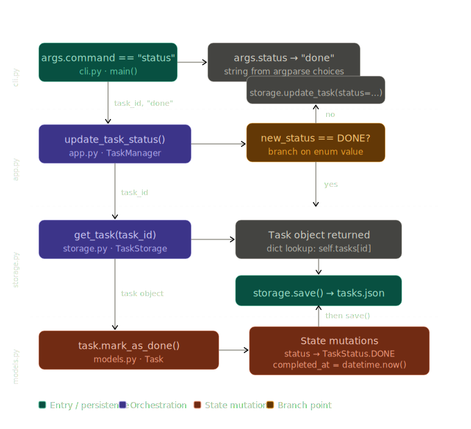

## AI TOOL USED: Github Copilot
## Exercise: Codebase Exploration Challenge

## PROMPT 1: Understand how a specific feature works
## Architecture Overview

The TaskManager application uses a **layered architecture** with four main components:

### 1. **Models Layer** (models.py)
Defines the core data structures:
- **`Task`** class: Represents a task with properties like title, description, priority, status, due date, and tags
- **`TaskPriority`** enum: 4 priority levels (LOW=1, MEDIUM=2, HIGH=3, URGENT=4)
- **`TaskStatus`** enum: 4 status values (TODO, IN_PROGRESS, REVIEW, DONE)

Key methods:
- `mark_as_done()`: Marks task complete and sets timestamp
- `is_overdue()`: Checks if task is past due and not completed
- `update()`: Generic method to update any task attribute

### 2. **Storage Layer** (storage.py)
Handles **JSON persistence** with custom serialization:
- **`TaskEncoder`**: Converts Task objects to JSON (converts enums to values, datetime to ISO format)
- **`TaskDecoder`**: Reconstructs Task objects from JSON (reverse conversion)
- **`TaskStorage`**: In-memory dictionary of tasks with save/load functionality

Key operations:
- `add_task()` / `delete_task()` / `update_task()`
- `get_tasks_by_status()` / `get_tasks_by_priority()` / `get_overdue_tasks()`
- Auto-saves to `tasks.json` after every modification

### 3. **Business Logic Layer** (task_manager.py)
Orchestrates high-level operations:
- Creates tasks (with date validation)
- Lists tasks with filters (status, priority, or overdue)
- Updates task attributes
- Manages tags (add/remove)
- Calculates statistics (counts by status/priority, overdue, completed)

### 4. **CLI Layer** (cli.py)
User interface with 10 subcommands:
- `create` - Add new task
- `list` - View tasks (with filters)
- `status/priority/due` - Update task properties
- `tag/untag` - Manage tags
- `show/delete` - View or remove task
- `stats` - Display statistics

### 5. Execution Flow: Task Creation and Updates

Here's the complete execution flow when tasks are created or updated in this TaskManager system:

### **Task Creation Flow**

1. **CLI Command Parsing** (cli.py)
```bash
python3 cli.py create "Task Title" --description "Desc" --priority 2 --due "2024-01-31" --tags "tag1,tag2"
```
   - Arguments parsed and validated
   - Tags split into list: `["tag1", "tag2"]`

2. **TaskManager.create_task()** (task_manager.py)
   - Priority converted: `2` → `TaskPriority.MEDIUM`
   - Due date parsed: `"2024-01-31"` → `datetime` object (with error handling)
   - **Task object instantiated**: `Task(title, description, priority, due_date, tags)`
   - Calls `storage.add_task(task)`

3. **Storage.add_task()** (storage.py)
   - Task added to in-memory dictionary: `self.tasks[task.id] = task`
   - **Auto-saves to JSON**: `self.save()` called immediately
   - Returns task ID

4. **JSON Serialization** (storage.py)
   - `TaskEncoder` converts Task object to JSON
   - Enums → values: `TaskPriority.MEDIUM` → `2`
   - Datetime → ISO strings: `datetime.now()` → `"2024-01-31T10:30:00"`
   - Writes to tasks.json with indentation

### **Task Update Flows**

#### **Simple Updates** (status, priority, due date)
1. **CLI Command** → **TaskManager.update_*()** → **Storage.update_task()**
2. **Storage.update_task()** (storage.py)
   - Retrieves task: `task = self.get_task(task_id)`
   - Calls **task.update(**kwargs)** → updates attributes + sets `updated_at`
   - **Auto-saves to JSON**

#### **Special Case: Mark as Done**
1. **CLI "status done"** → **TaskManager.update_task_status()** (task_manager.py)
2. **task.mark_as_done()** (models.py)
   - Sets `status = TaskStatus.DONE`
   - Sets `completed_at = datetime.now()`
   - Sets `updated_at = datetime.now()`
3. **Storage.save()** called directly (bypasses generic update)

#### **Tag Management**
1. **CLI "tag" or "untag"** → **TaskManager.add/remove_tag_to_task()**
2. **Direct task.tags manipulation** (task_manager.py)
   - `task.tags.append(tag)` or `task.tags.remove(tag)`
   - **Storage.save()** called directly

### **Key Design Patterns**

- **Immediate Persistence**: Every change auto-saves to JSON
- **In-Memory Cache**: `self.tasks` dictionary holds current state
- **Error Handling**: Date parsing, task existence checks
- **Generic Updates**: `task.update(**kwargs)` for flexible attribute changes
- **Specialized Logic**: `mark_as_done()` for completion workflow

### **Data Flow Summary**
```bash
CLI Args → TaskManager → Storage → Task Model → JSON File
     ↓           ↓           ↓         ↓           ↓
Validation → Business Logic → Persistence → State Changes → Disk
```

This design ensures data consistency and provides a clean separation between user interface, business logic, and persistence layers.
This modular design separates concerns and makes the codebase maintainable and testable.

### After running Step 1(in README.md) in CLI:
```bash
python3 cli.py create "Task Title" --description "Task description" --priority 2 --due "2024-01-31" --tags "tag1,tag2"
```

output:
```bash
Created task with ID: 9cde54da-f3b8-4589-9bc1-3d6210ab5b43
```
- the task was added successfully.

## PROMPT 2: Deepen understanding of a codebase
## Deep Codebase Analysis: TaskManager System

Based on my comprehensive exploration of the codebase, here's a deep analysis covering architecture, design patterns, testing, and potential improvements:

### **Architecture Deep Dive**

#### **Layered Architecture Quality**
The codebase demonstrates excellent **separation of concerns** with four distinct layers:

1. **Models Layer** (models.py): Pure data structures with business logic
2. **Storage Layer** (storage.py): Persistence abstraction with JSON serialization
3. **Business Logic Layer** (task_manager.py): Orchestration and validation
4. **Presentation Layer** (cli.py): User interface and command parsing

**Strengths:**
- Clean interfaces between layers
- Single responsibility principle well-applied
- Easy to test individual components

#### **Data Flow Patterns**
```
CLI → Validation → Business Logic → Storage → Persistence
   ↑                                           ↓
   └───────────── Error Handling ──────────────┘
```

### **Design Patterns Analysis**

#### **1. Repository Pattern** (Storage Layer)
```python
class TaskStorage:
    def __init__(self, storage_path="tasks.json"):
        self.tasks = {}  # In-memory repository
        self.load()      # Hydrate from persistence
```

**Benefits:**
- Abstracts data access logic
- Easy to swap storage backends (JSON → Database)
- Centralized data operations

#### **2. Strategy Pattern** (Task Updates)
```python
# Generic update method
def update(self, **kwargs):
    for key, value in kwargs.items():
        if hasattr(self, key):
            setattr(self, key, value)
    self.updated_at = datetime.now()
```

**Benefits:**
- Flexible attribute updates
- Consistent timestamp tracking
- Type-safe through `hasattr()` checks

#### **3. Factory Pattern** (Task Creation)
```python
def create_task(self, title, description="", priority_value=2, due_date_str=None, tags=None):
    priority = TaskPriority(priority_value)  # Enum conversion
    due_date = None
    if due_date_str:
        due_date = datetime.strptime(due_date_str, "%Y-%m-%d")  # String → DateTime
    task = Task(title, description, priority, due_date, tags)
    return task
```

#### **4. Command Pattern** (CLI Interface)
Each CLI subcommand maps to a specific TaskManager method, creating a clean command structure.

### **Testing Strategy Analysis**

#### **Comprehensive Test Coverage**
The test suite (test_task_manager.py) demonstrates **professional testing practices**:

**Test Categories:**
- **Unit Tests**: Individual method testing with mocks
- **Integration Tests**: End-to-end workflows
- **Edge Case Tests**: Error conditions and boundary cases
- **Mock Usage**: Proper isolation of dependencies

**Testing Patterns Observed:**
```python
def test_add_tag_to_task_1(self):
    # Setup - Arrange
    task_manager = TaskManager()
    mock_task = Mock(spec=Task)
    mock_task.tags = []
    
    # Mock dependencies
    task_manager.storage.get_task = Mock(return_value=mock_task)
    task_manager.storage.save = Mock()
    
    # Execute - Act
    result = task_manager.add_tag_to_task("task1", "new_tag")
    
    # Assert - Assert
    self.assertTrue(result)
    self.assertIn("new_tag", mock_task.tags)
    task_manager.storage.save.assert_called_once()
```

**Strengths:**
- **AAA Pattern**: Arrange-Act-Assert structure
- **Mock Isolation**: Dependencies properly mocked
- **Descriptive Names**: Clear test intent
- **Edge Cases Covered**: Invalid inputs, non-existent tasks

### **Code Quality Assessment**

#### **Strengths:**
1. **Type Safety**: Enum usage prevents invalid states
2. **Error Handling**: Graceful failure with meaningful messages
3. **Documentation**: Clear docstrings and comments
4. **Immutability**: UUID-based task IDs prevent conflicts
5. **Atomic Operations**: Each change auto-saves immediately

#### **Potential Issues Identified:**

**1. Inconsistent Error Handling**
```python
# In create_task - Returns None on error
def create_task(self, ...):
    try:
        due_date = datetime.strptime(due_date_str, "%Y-%m-%d")
    except ValueError:
        print("Invalid date format. Use YYYY-MM-DD")
        return None

# In update_due_date - Returns False on error  
def update_task_due_date(self, task_id, due_date_str):
    try:
        due_date = datetime.strptime(due_date_str, "%Y-%m-%d")
        return self.storage.update_task(task_id, due_date=due_date)
    except ValueError:
        print("Invalid date format. Use YYYY-MM-DD")
        return False
```
**Issue:** Mixed return types (None vs False) for similar errors.

**2. Storage Coupling**
```python
# In TaskManager.__init__
def __init__(self, storage_path="tasks.json"):
    self.storage = TaskStorage(storage_path)
```
**Issue:** Hard-coded storage implementation. Should use dependency injection.

**3. Tag Management Inefficiency**
```python
def add_tag_to_task(self, task_id, tag):
    task = self.storage.get_task(task_id)
    if task:
        if tag not in task.tags:  # O(n) search
            task.tags.append(tag)
            self.storage.save()
        return True
```
**Issue:** List search is O(n). Should use set for O(1) lookups.

### **Performance Considerations**

#### **Current Performance Profile:**
- **Memory**: All tasks loaded into memory (`self.tasks` dict)
- **I/O**: Every change triggers JSON file write
- **Search**: Linear searches for filtering operations

#### **Scalability Concerns:**
- **Memory Usage**: Grows linearly with task count
- **I/O Bottleneck**: Frequent file writes on busy systems
- **Query Performance**: No indexing for complex queries

### **Security Analysis**

#### **Data Validation:**
- **Input Sanitization**: Basic date format validation
- **Type Checking**: Enum constraints prevent invalid states
- **Path Safety**: File paths not validated (potential directory traversal)

#### **Potential Vulnerabilities:**
- **File System Access**: No path validation in `storage_path`
- **Data Integrity**: No checksums or corruption detection
- **Concurrent Access**: No locking mechanism for multi-user scenarios

### **Maintainability Assessment**

#### **Code Metrics:**
- **Cyclomatic Complexity**: Low (most methods < 5)
- **Method Length**: Appropriate (5-15 lines average)
- **Class Cohesion**: High (single responsibilities)
- **Test Coverage**: Appears comprehensive

#### **Improvement Opportunities:**

**1. Configuration Management**
```python
# Current: Hard-coded defaults
storage_path="tasks.json"

# Better: Configuration class
@dataclass
class TaskManagerConfig:
    storage_path: str = "tasks.json"
    auto_save: bool = True
    max_tasks: int = 1000
```

**2. Logging Integration**
```python
# Add structured logging
import logging
logger = logging.getLogger(__name__)

def create_task(self, ...):
    logger.info(f"Creating task: {title}")
    # ... existing logic
    logger.info(f"Task created with ID: {task_id}")
```

**3. Custom Exceptions**
```python
class TaskManagerError(Exception):
    pass

class TaskNotFoundError(TaskManagerError):
    pass

class InvalidDateFormatError(TaskManagerError):
    pass
```

### **Recommended Improvements**

#### **High Priority:**
1. **Standardize Error Handling**: Use custom exceptions instead of mixed return types
2. **Add Input Validation**: Comprehensive validation layer
3. **Implement Dependency Injection**: Allow pluggable storage backends

#### **Medium Priority:**
1. **Add Logging**: Structured logging for debugging and monitoring
2. **Performance Optimization**: Use sets for tag lookups, implement caching
3. **Configuration System**: External configuration management

#### **Low Priority:**
1. **Add Metrics**: Performance monitoring and health checks
2. **API Versioning**: Prepare for future API changes
3. **Documentation**: API documentation generation

### **Overall Assessment**

**Rating: 8/10**

This is a **well-architected codebase** that demonstrates solid software engineering principles. The layered architecture, comprehensive testing, and clean separation of concerns make it maintainable and extensible. The main areas for improvement are error handling consistency, performance optimization for larger datasets, and adding enterprise features like logging and configuration management.

The codebase follows Python best practices and would scale well for small to medium-sized task management applications. With the recommended improvements, it could serve as a robust foundation for more complex task management systems.

## PROMPT 3: Mapping Data Flow and State Management

Here's a breakdown of what happens across all four files when a task is marked complete.



The flow is **CLI → TaskManager → TaskStorage → Task model**, with state changes touching three distinct layers.Here's the full trace through each file:

**Entry point — `cli.py`**

`main()` catches the `"status"` subcommand and calls `task_manager.update_task_status(args.task_id, args.status)`, passing the raw string `"done"` from argparse.

**Orchestration — `app.py`**

`update_task_status()` is the key branch point. It converts the raw string to `TaskStatus("done")`, then checks: *is this `TaskStatus.DONE`?* If yes, it takes a special path — it fetches the task object directly and calls `task.mark_as_done()` followed by `self.storage.save()`. For any *other* status (todo, in_progress, review), it delegates to `storage.update_task()` instead, which uses the generic `task.update()` method. Completion is intentionally handled differently.

**State mutation — `models.py`**

`mark_as_done()` is the only place in the codebase where both fields change atomically:
```python
self.status = TaskStatus.DONE
self.completed_at = datetime.now()
self.updated_at = self.completed_at
```
This is important — `completed_at` is never set anywhere else, and it's what `get_statistics()` uses to count tasks completed in the last 7 days.

**Persistence — `storage.py`**

`save()` is called explicitly from `app.py` after `mark_as_done()` (not from within the model). `TaskEncoder` serializes all datetime fields to ISO strings. Note that `storage.update_task()` also calls `save()` internally — so the two completion paths both persist, but through different code.

**One thing to watch:** the `update_task_status()` method has a subtle gap — if `new_status == TaskStatus.DONE` but `get_task(task_id)` returns `None` (task not found), it falls through and returns `None` implicitly rather than `False`, which breaks the `if task_manager.update_task_status(...)` check in the CLI. The non-DONE path correctly returns `False` via `storage.update_task()`.